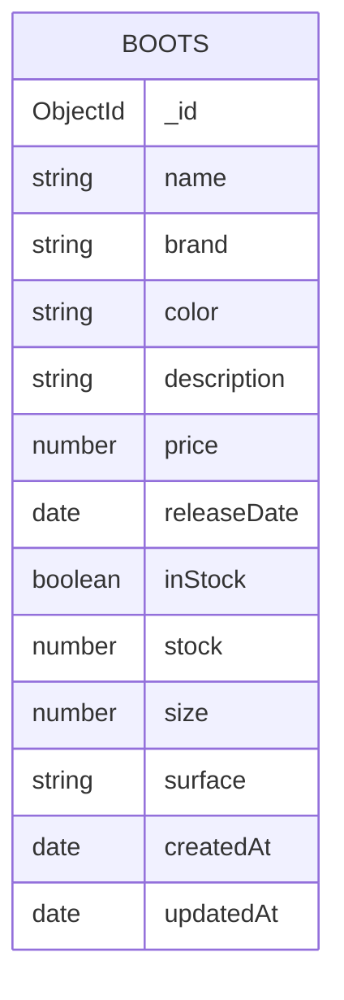

# Proyecto Final Integrador — Tienda de Botas de Fútbol

## 1) Nombre del proyecto
**FootStore 360 — Tienda de Botas de Fútbol**

## 2) Problema que resuelve
Las tiendas deportivas pequeñas suelen gestionar su inventario de botas de fútbol de forma manual, lo que provoca errores en stock, duplicidad de productos y dificultad para consultar información concreta por talla, superficie o disponibilidad.

Este proyecto resuelve ese problema con una aplicación full-stack que centraliza el catálogo y permite gestionar el inventario desde dos clientes distintos (Angular y React) consumiendo la misma API.

## 3) Descripción funcional
El sistema permite:
- Registrar botas de fútbol.
- Listar inventario con paginación.
- Buscar y filtrar por superficie.
- Ver detalle de cada bota.
- Editar productos.
- Eliminar productos.

La solución está construida con arquitectura tipo MEAN:
- **Backend:** Node.js + Express + MongoDB (Mongoose).
- **Frontend 1:** Angular.
- **Frontend 2:** React.

---

## 4) Arquitectura del proyecto
```bash
/backend
/frontend-angular
/frontend-react
```

---

## 5) Entidad principal
### Colección: `boots`

| Campo | Tipo | Requerido | Restricciones |
|---|---|---|---|
| `_id` | ObjectId | Sí (Mongo) | Identificador único |
| `name` | String | Sí | Min 3 caracteres |
| `brand` | String | Sí | No vacío |
| `color` | String | Sí | No vacío |
| `description` | String | Sí | Min 10 caracteres |
| `price` | Number | Sí | Rango: 30 a 500 |
| `releaseDate` | Date | Sí | No futura |
| `inStock` | Boolean | Sí | true/false |
| `stock` | Number | Sí | Mínimo 0 |
| `size` | Number | Sí | Rango: 36 a 47 |
| `surface` | String | Sí | Enum: FG, AG, TF, IC |
| `createdAt` | Date | Sí | Automático |
| `updatedAt` | Date | Sí | Automático |

Índice único compuesto para evitar duplicados:
- `name + brand + size + color`

### Diagrama de colección (MongoDB)


---

## 6) Reglas de negocio implementadas
1. **No duplicados:** no se permite registrar dos botas con la misma combinación `name + brand + size + color`.
2. **Rango de precio:** solo se aceptan precios entre **30€ y 500€**.
3. **Consistencia de stock:** si `inStock = false`, entonces `stock` debe ser `0`.
4. **Fecha válida:** `releaseDate` no puede ser una fecha futura.

---

## 7) Endpoints documentados (API v1)
Base URL local: `http://localhost:4000`

### Documentación
- `GET /api/v1/documentation`

### Boots CRUD
- `GET /api/v1/boots/get/all?page=1&limit=5&search=&surface=&inStock=`
  - **Parámetros query:** `page`, `limit`, `search`, `surface`, `inStock`.
  - **Respuesta:** `{ ok, page, limit, total, totalPages, data: [] }`
- `GET /api/v1/boots/get/:id`
  - **Parámetro:** `id`.
  - **Respuesta:** `{ ok, data: {...} }`
- `POST /api/v1/boots/post`
  - **Body:** entidad `Boot`.
  - **Respuesta:** `{ ok, message, data }`
- `PUT /api/v1/boots/update/:id`
  - **Parámetro:** `id`.
  - **Body:** entidad `Boot`.
  - **Respuesta:** `{ ok, message, data }`
- `PATCH /api/v1/boots/update/:id`
  - **Parámetro:** `id`.
  - **Body parcial:** campos de `Boot`.
  - **Respuesta:** `{ ok, message, data }`
- `DELETE /api/v1/boots/delete/:id`
  - **Parámetro:** `id`.
  - **Respuesta:** `{ ok, message }`

### Ejemplo de body (POST/PUT)
```json
{
  "name": "Mercurial Vapor 15",
  "brand": "Nike",
  "color": "Naranja",
  "description": "Bota ligera para velocidad y cambios de ritmo explosivos.",
  "price": 179,
  "releaseDate": "2023-06-12",
  "inStock": true,
  "stock": 8,
  "size": 41,
  "surface": "FG"
}
```

---

## 8) Base de datos poblada
El backend incluye script de seed con **21 registros** de botas de fútbol.

Comando:
```bash
cd backend
npm run seed
```

---

## 9) Frontend Angular (fase 2)
Implementado:
- Consumo completo de API mediante servicio HTTP.
- Componentes separados: listado, detalle y formulario.
- Formularios reactivos.
- Validaciones.
- CRUD completo.
- Paginación.
- Filtros.
- Bootstrap.
- Loader de carga.
- Mensajes de éxito/error.

---

## 10) Frontend React (fase 3)
Implementado:
- Consumo de la misma API con Axios.
- Componentes funcionales.
- Hooks (`useState`, `useEffect`).
- Formularios controlados.
- CRUD completo con vista detalle por id.
- React Router.
- Bootstrap.
- Validaciones.
- Manejo de estado local.
- Feedback de éxito/error y loader.

---

## 11) Instalación y ejecución

### Backend
```bash
cd backend
cp .env.example .env
npm install
npm run seed
npm run dev
```

### Angular
```bash
cd frontend-angular
npm install
npm start
```

### React
```bash
cd frontend-react
npm install
npm run dev
```

---

## 12) URLs de despliegue (rellenar cuando publiques)
API: https://appdwec-api.vercel.app
Frontend Angular: https://appdwec-angular.vercel.app
Frontend React: https://appdwec-react.vercel.app
